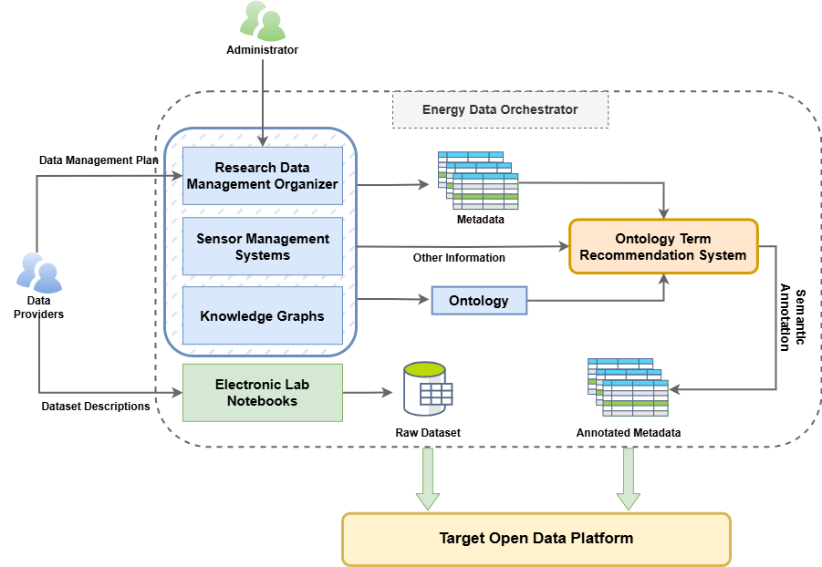

# Ontology Term Recommendation System for Energy data Publication
This repository contains the base code for an ontology term recommendation system, which will be integrated into the Energy Data Orchestrator (EDO) platform,  and its user interface will be deployed online alongside EDO.

The goal of this system is to assist users in semantically annotating their datasets. When a user provides column descriptions through EDO’s interface, this system will:

- Automatically suggest the top-k most relevant ontology terms from a preselected ontology

- Support semantic interoperability and ensure that your data is FAIR (Findable, Accessible, Interoperable, Reusable)

---

## FAIR Energy Data Publication Workflow



## Install dependencies
#### Setup with Conda
This project uses a Conda environment defined in `environment.yml`  

**Step 1: Create the environment**
```
conda env create -f environment.yml
```
**Step 2: Activate the enviornment**
```
conda activate myenv
```
---
## Usage

#### 1. Run recommendation system

```
py src/main.py
```


---

## Example Output
The example matching between the LLEC Dataset and Open Energy Ontology (OEO) can be found in `results/matches.json`  


---

## Author

**N. Liu**  
Karlsruher Institut für Technologie (KIT)   
✉️Email: nan.liu@kit.edu  
🆔Orcid: [0009-0005-8768-7072](https://orcid.org/0009-0005-8768-7072)